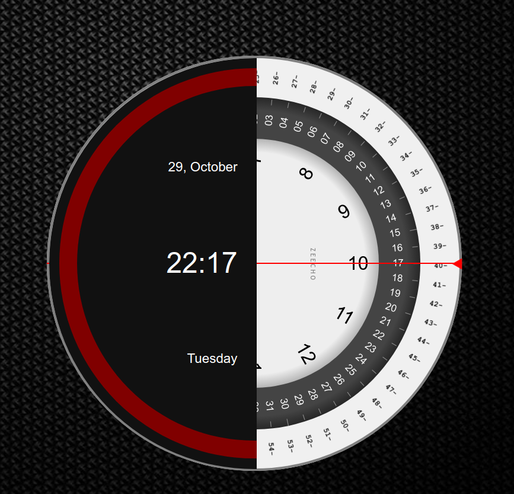

Here’s a README for your custom clock project:

---

# Circular Analog-Digital Clock



A modern, circular clock that combines analog and digital time display. This clock is created using HTML, vanilla CSS, and vanilla JavaScript, with no external libraries. The design features a unique split layout with a dark theme on the left side and a light theme on the right. This clock also displays the current date, time, and day of the week.

## Features

- **Analog Hour, Minute, and Second Markers**: Rotating dials represent the current hour, minute, and second positions.
- **Digital Time Display**: Shows the time in 24-hour format at the center of the clock.
- **Date and Day Display**: The current date and day of the week are displayed prominently.
- **Dynamic Design**: The clock automatically updates every second.
- **Dark and Light Theme Split**: Left side shows a dark theme, while the right side has a light theme, creating a visually appealing dual theme.

## Technologies Used

- **HTML**
- **CSS** (for styling and layout)
- **JavaScript** (for dynamic updates and clock calculations)

## How It Works

The clock utilizes JavaScript to calculate the current time and updates the rotations of each dial dynamically. The hour, minute, and second markers are rotated based on real-time calculations using CSS transforms. The JavaScript code uses `setInterval` to update the clock every second.

### Key JavaScript Functions

1. **`insertMinutes()`**: Creates and positions the minute markers around the circle.
2. **`insertSeconds()`**: Creates and positions the second markers around the circle.
3. **`insertHours()`**: Creates and positions the hour markers.
4. **`timeRotate()`**: This function calculates the current time and rotates the respective dials to match the current hour, minute, and second positions.

## Getting Started

### Prerequisites

- A modern web browser (Chrome, Firefox, Edge, Safari)

### Installation

1. **Clone the repository**:
   ```bash
   git clone https://github.com/yourusername/circular-clock.git
   ```

2. **Open the project folder**:
   ```bash
   cd circular-clock
   ```

3. **Open `index.html` in your browser**:
   - Simply double-click `index.html` to view the clock in your default browser, or open it manually by dragging it into the browser window.

### Files

- **`index.html`**: Main HTML structure.
- **`style.css`**: CSS file containing the styles for layout and themes.
- **`script.js`**: JavaScript file containing the logic for the clock's dynamic updates.
